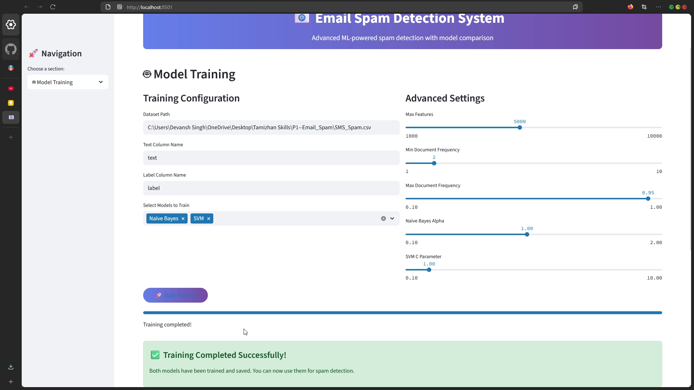

# 📧 Email Spam Detection System

Welcome to the **Email Spam Detection System** – the only place where your emails are judged harder than you were at your last family reunion. This project uses machine learning to decide if your emails are spam or ham (because apparently, those are the only two food groups in the world of email).

---

## 🎬 Video Walkthrough

> <b>Watch the magic happen:</b>
>
> [](https://youtu.be/kaRiQhI4q-M)
>
> <i>Click the thumbnail above to see a full walkthrough of the Email Spam Detection System in action!</i>

---

## 📸 Screenshots

<div style="display: flex; flex-wrap: wrap; gap: 10px;">
  
  
  
  
  
  
  
</div>

## 🚀 Features

- **Modern Streamlit UI**: Because you deserve more than a command line.
- **Dataset Analysis**: Upload your own CSV or use the default one. See stats, charts, and more numbers than you ever wanted.
- **Model Training**: Train Naive Bayes and SVM models. Or just click buttons and pretend you know what those are.
- **Spam Detection**: Paste your email or upload a batch. Get instant judgment.
- **Model Comparison**: See which model is the teacher’s pet (spoiler: it’s usually Naive Bayes).
- **Settings**: Tweak, reset, and break things to your heart’s content.

---

## 🏗️ Project Structure

```
P1--Email_Spam/
├── app.py                # The Streamlit UI (run this!)
├── run_app.py            # (Optional) Script to launch the app
├── requirements.txt      # All the stuff you need to install
├── SMS_Spam.csv          # Default dataset (because who has time to find one?)
├── spam_classifier_*.pkl # Saved models (auto-generated)
├── src/
│   ├── data_loader.py    # Data loading logic
│   ├── preprocessor.py   # Text cleaning magic
│   ├── models.py         # Model classes
│   ├── compare_models.py # Model comparison logic
│   └── ...
└── ...
```

---

## 🛠️ Setup & How To Run (a.k.a. How Not To Break Things)

1. **Clone this repo** (or just download it like a normal person):

   ```powershell
   git clone <this-repo-url>
   cd P1--Email_Spam
   ```

2. **Install dependencies** (because Python won’t do it for you):

   ```powershell
   pip install -r requirements.txt
   ```

3. **Run the app** (the fun part):

   ```powershell
   streamlit run app.py
   ```

4. **Open your browser** (if it doesn’t open automatically) and go to:
   [http://localhost:8501](http://localhost:8501)

5. **Click around, upload stuff, break things, and enjoy!**

---

## 🤔 FAQ (Frequently Annoying Questions)

- **Q: Why is my model not training?**
  A: Did you check the dataset path? Did you try turning it off and on again?

- **Q: Can I use my own dataset?**
  A: Yes! Upload a CSV in the Dataset Analysis tab. Just make sure it has `text` and `label` columns, or the app will judge you.

- **Q: What if I break something?**
  A: There’s a reset button in Settings. Or just delete everything and reclone. We won’t tell anyone.

- **Q: Why is it called ham?**
  A: Because the people who invented spam filters were hungry.

---

## 🧑‍💻 Credits

- Built with [Streamlit](https://streamlit.io/), [scikit-learn](https://scikit-learn.org/), [NLTK](https://www.nltk.org/), and a lot of caffeine.
- UI design inspired by every SaaS dashboard ever.

---

## 🦄 License

MIT. Do whatever you want. Just don’t blame us if your boss gets mad at your spam filter.
